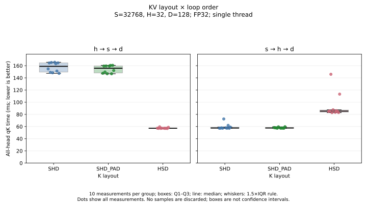

# KV Cache Layout, Padding, and Loop Order

## Objective

Investigate whether the padding benefit observed in single-head qK measurements persists when all heads are processed, and how that benefit depends on loop order.

## Single-head observations and hypothesis

With D=128, shifting the sequence stride by ±128 bytes from 16 KiB improved single-head qK performance. At S=8192, adding 128 bytes reduced median execution time by approximately 28–30%, bringing performance close to contiguous access. At S=32768, the ±128-byte changes reduced time by approximately 20–25%, but execution remained approximately 2.1–2.2 times slower than contiguous access.

These improvements were observed across three runs. They suggested that address regularity, rather than address span alone, contributed to the slowdown. The roles of cache conflicts, TLB behavior, and prefetching remain unresolved.

The next hypothesis was that adding padding between tokens could also improve all-head processing.

## All-head experiment

- Environment: Apple M1, Clang 22.1.0; `-std=c++17 -O3 -march=native`.
- Shape: S=32768, H=32, D=128; FP32; single thread.
- Operation: qK dot products for all heads. Softmax, multiplication by V, and KV updates are excluded.
- Layouts: SHD, HSD, and SHD_PAD.
- SHD_PAD adds 32 floats (128 bytes) after each token's H×D elements. This adds 4 MiB, or approximately 0.78%, to the K allocation.
- Loop orders: h→s→d and s→h→d.
- Output layout remains `out[h*S+s]` for both orders.
- Inputs contain the same logical values; outputs are checked against a double-precision reference.
- Allocations are page-aligned. Timing excludes allocation, initialization, packing, and validation.
- Each condition is warmed immediately before timing; layout order is shuffled. The same buffers are reused.

## Supplied measurements

The figure below uses the two supplied tables: **10 measurements per layout and loop order, 60 measurements in total**. These are individual measurements within one run per loop order, not 10 independent process runs. They are not pooled with the other repeated runs discussed below. Times are in milliseconds for one complete all-head qK call.



Boxes show the interquartile range (Q1–Q3), and the central line is the median. Whiskers extend to the most extreme observations within 1.5×IQR of the quartiles. Dots show every measurement, including observations beyond the whiskers. No measurements are removed. The two panels use the same linear time scale, and boxplots do not represent confidence intervals.

| Layout | h→s→d median (ms) | s→h→d median (ms) |
|---|---:|---:|
| SHD | 158.954 | 57.620 |
| SHD_PAD | 155.808 | 57.670 |
| HSD | 57.223 | 85.387 |

For these supplied measurements, padding reduced the h→s→d median by 1.98%. With s→h→d, the padded median was 0.09% higher. These small differences alone do not establish a reproducible padding benefit.

The supplied s→h→d samples also include high observations, such as 145.91 ms for HSD. They remain visible in the figure; their cause has not been established.

## Repeated-run context

Separate analysis of three runs per loop order produced the following ranges of per-run medians. These are ranges, not confidence intervals, and they are not the samples plotted above.

| Layout | h→s→d (ms) | s→h→d (ms) |
|---|---:|---:|
| SHD | 152.04–164.53 | 57.31–57.62 |
| SHD_PAD | 152.41–159.71 | 57.24–57.67 |
| HSD | 57.08–57.99 | 82.86–85.39 |

Padding reduced h→s→d time by 1.98%, −0.24%, and 2.93% in the three runs. For s→h→d, the reductions were −0.09%, 0.12%, and −0.14%. An improvement was therefore not consistently reproduced across runs.

The repeated-run ranges summarize earlier experiment records. Only the 60 explicitly supplied measurements are included in this note's data file; reproducing those ranges requires retaining the remaining original run CSVs separately.

## Assembly inspection and correction

An earlier h→s→d implementation stored the partial sum inside the d loop, while the s→h→d implementation stored only the completed dot product. This discrepancy was corrected and h→s→d was remeasured. The h→s→d results reported here use the corrected implementation; earlier measurements are superseded for the loop-order comparison.

After correction, both versions have similar main d-loop structures: four-lane vector multiplication, 16 elements processed per main iteration, and sequential scalar accumulation. The earlier runtime alias checks in the h→s→d version are no longer present, and the output store occurs after the dot product.

The outer loops still change K traversal, Q access/reuse, and output store order. Their individual performance contributions have not been isolated.

## Conclusions and limitations

- The preferred layout depends on loop order: SHD is faster with s→h→d, while HSD is faster with h→s→d.
- Matching layout and traversal order brings both approaches to approximately 57–58 ms in this configuration.
- The single-head padding improvement does not generalize to a stable all-head improvement in these experiments.
- Similar inner-loop arithmetic supports an access-order explanation for the ranking reversal, but does not identify the specific memory-system mechanism.
- Measurements cover one CPU and a repeated-buffer workload. Full attention, KV updates, other shapes, and other CPUs remain to be evaluated.
- All three K layouts remain allocated during a run (approximately 1.50 GiB combined). Memory-pressure effects have not been independently measured.

## Reproduce the figure

The plotting script requires Python 3 and Matplotlib. From this directory:

```bash
python3 -m pip install matplotlib
python3 plot_boxplots.py
```

The script reads `data/measurements.csv` and generates PNG and SVG files in `figures/`. Input and output paths can also be supplied with `--input` and `--out`. Existing figure files with the same names are overwritten; input data are not modified.
